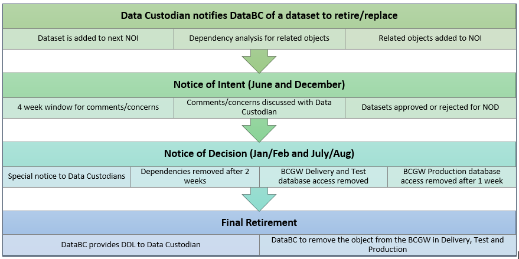

# BC GEOGRAPHIC WAREHOUSE DATA RETIREMENT WORKFLOW

|**AUDIENCE**|  |  |  |
|:---:|:---:|:---:|:---:|
| *Data Publishers* | *Business Analysts* | *Business Portfolio Managers* | *Application Administrators* | *Data Consumers* 

### Retirement Process and Workflow
Data Custodians are ultimately responsible for the Data Lifecycle of their data, which includes but is not limited to the maintenance, accuracy, licensing and the decision to replace, retire or archive their data.

To retire data from the BCGW, please open a ticket with the [ Data Systems & Services request system](https://dpdd.atlassian.net/servicedesk/customer/portal/1/group/5/create/26).

#### Notifications
From the information provided by the custodian, a ***Notice of Intent*** is created that includes metadata links to replacement datasets if available. After review a ***Notice of Decision*** is sent out.

These notifications are sent out twice a year to allow application managers to schedule updates to their applications. Emergency disabling or temporary disabling of datasets can happen but will require rationale.

Notifications are sent out by the DataBC Data Retirement team and [hosted in the BC Data Catalogue](https://catalogue.data.gov.bc.ca/dataset/3b1c8bbf-4a17-43f0-a5e4-b3e518ef77d1)

**Notice of Intent (NOI)**
Timelines: 
* **June** and **December** with a **4 week** allowance for comments by users.
* These comments are then compiled and sent to the data custodians for review.
* A dataset at this time may be removed from the list for the associated Notice of Decision.

**Notice of Decision (NOD)**
Timelines: 
* **Late July/Early Aug** with a **2 week** notice before dependencies will be removed.
* DataBC will do a dependency analysis and will work to other areas within DataBC as well as application owners to disable or redirect datasets.

**Dependencies:**
DataBC Managed:
* iMapBC & IMF2 Applications
* Layer Library
* Distribution Service
* WFS/WMS/KML
* Metadata
* Spatial Overlay Engine (SOE)
* Replication
* Direct Connects
    * An audit may be put on the datasets to be retired to help identify what applications may reference them.

Externally Managed:
* If a specific application requires additional time, then special database grants will be set up. 

**Database Grants Revoked**
* Security - once dependencies are removed security to datasets will be revoked

Timelines:
* **Delivery and Test BCGW** will be revoked **one week** before **Production**

**Deletion/Archival:**
* DataBC will export a copy of the DDL and provide these to the data custodian.
* Requests for exports of the data content can be accommodated, where business areas do not have GIS support.
